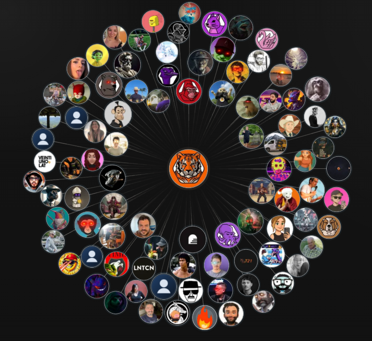

<div align="center">

# Nostr Explorer

### Explorador de identidad Nostr orientado a grafos, relays y evidencia exportable

[](https://nostr-en-el-espacio.vercel.app/)
[](https://github.com/lacrypta/hackathons-2026)
[](https://nextjs.org/)
[](https://github.com/nostr-protocol/nostr)

[Ver demo](https://nostr-en-el-espacio.vercel.app/) - [Hackathon La Crypta](https://github.com/lacrypta/hackathons-2026) - [Arquitectura actual](./docs/current-codebase.md)

<br />



<sub>Vista graph-first para explorar identidades, relaciones y senales de confianza con lectura relay-aware.</sub>

</div>

> Proyecto participante de **IDENTITY**, el desafio de **abril de 2026** dentro de **Lightning Hackathons 2026** de **La Crypta**.

Este repositorio nacio a partir de `nostr-starter`, pero hoy responde a otro producto: una experiencia **graph-first** para explorar identidad en Nostr, leer contexto social, entender incertidumbre de relays y exportar snapshots auditables.

La documentacion esta escrita en espanol y pensada para una audiencia tecnica de Argentina: gente que quiera preparar una demo para jurado, investigar identidad en Nostr o extender el proyecto sin tener que reconstruir primero el estado real del repo.

## Demo

**Deploy publico:** [https://nostr-en-el-espacio.vercel.app/](https://nostr-en-el-espacio.vercel.app/)

## Que resuelve este proyecto

- Explora vecindarios de identidad a partir de un `npub` o `nprofile`
- Descubre conexiones, mutuals, comunidades, liderazgos y puentes dentro del grafo
- Trabaja con relays reales, mostrando salud, cobertura parcial y estado stale
- Permite comparar identidades dentro del canvas
- Integra senales como perfiles, badges y zaps
- Exporta evidencia como snapshots auditables en un ZIP deterministico

## Por que encaja bien en IDENTITY

La propuesta no se limita a "ver un perfil". El foco esta en **identidad como red**:

- identidad relacional
- descubrimiento relay-aware
- senales de confianza y contexto
- evidencia exportable para demo, investigacion o validacion

Ese enfoque conversa bien con lo que suele valorar un jurado tecnico: innovacion en identidad, demo funcionando, criterio de protocolo y una historia de producto clara.

## Superficies del producto

| Ruta | Para que sirve |
| --- | --- |
| `/` | Explorador principal del grafo de identidad |
| `/profile` | Vista clasica del perfil autenticado |
| `/badges` | Vista de badges NIP-58 de la cuenta autenticada |

## Funcionalidades actuales

- Login con `NIP-07`, `nsec` y `NIP-46` bunker
- Flujo QR para Nostr Connect y bunker login
- Carga relay-aware con timeouts y fallback visual
- Expansion estructural de nodos sin perder la sesion del grafo
- Paneles de configuracion para visualizacion, relays y export
- Analisis del grafo en background con Web Workers
- Persistencia local con Dexie para sostener la experiencia del explorador
- Pipeline de export pensado como paquete de evidencia, no solo como descarga

## Stack

- Next.js 16
- React 19
- TypeScript
- Tailwind CSS v4
- NDK v3
- nostr-tools
- Zustand
- deck.gl
- d3-force
- Dexie
- Web Workers
- qrcode.react
- fflate

## Desarrollo local

```bash
npm install
npm run dev
npm run build
npm run lint
```

Los workers del grafo se recompilan automaticamente en `predev`, `prebuild` y `prestart`.

## Arquitectura rapida

```text
src/
|-- app/                  # Rutas Next.js
|-- components/           # Navbar, login, profile, badges
|-- features/graph/       # Aplicacion principal del explorador
|   |-- analysis/         # Modelos y analisis del grafo
|   |-- app/store/        # Estado global del grafo
|   |-- components/       # Canvas, paneles y controles
|   |-- db/               # Persistencia local con Dexie
|   |-- export/           # Snapshot y ZIP auditable
|   |-- kernel/           # Runtime y orquestacion
|   |-- nostr/            # Transporte y relays especificos del grafo
|   |-- render/           # deck.gl, viewport e imagen
|   `-- workers/          # Procesamiento pesado en background
|-- lib/                  # Helpers compartidos de Nostr y media
|-- store/                # Estado compartido de autenticacion
`-- types/                # Tipados
```

## Documentacion util

- [Guia del codebase actual](./docs/current-codebase.md)
- [Diagramas para programadores](./docs/diagramas-programador/README.md)
- [Workflow de validacion del avatar pipeline](./docs/avatar-pipeline-validation.md)
- [Resolucion de problemas del avatar pipeline](./docs/avatar-pipeline-troubleshooting.md)
- [Instrucciones del repo para agentes](./AGENTS.md)

## Nota importante

La superficie principal del producto es el grafo en `/`. `profile` y `badges` siguen siendo utiles, pero la historia mas fuerte del proyecto esta en la exploracion de identidad, la incertidumbre de relays y la exportacion de evidencia.


